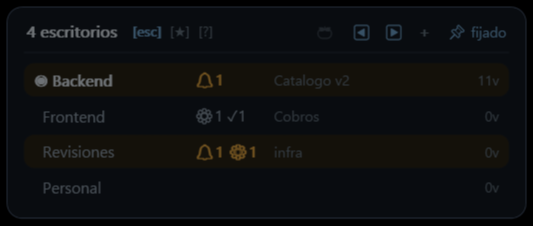
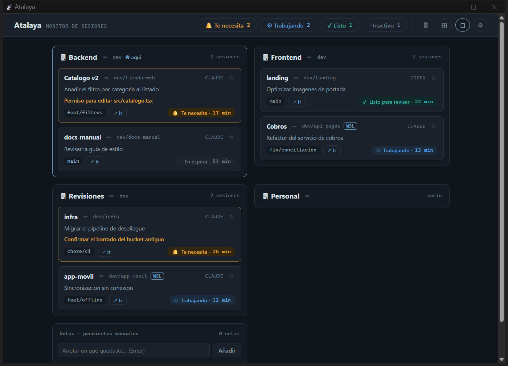

# Atalaya

Monitor de sesiones paralelas de agentes (Claude Code / Codex) a través de
escritorios virtuales de Windows y WSL. Resuelve la pérdida de contexto al
trabajar en varios clones/proyectos a la vez: en cualquier escritorio ves qué
sesión está trabajando, cuál terminó (y hace cuánto) y cuál espera tu respuesta.

## Así se ve

Una **píldora** flotante, siempre encima de todo, con un botón por escritorio
virtual y los contadores por estado. Ámbar con 🔔 = alguien espera tu respuesta:


Al pasar el ratón (o con un clic, según prefieras) se despliega el **deck**: una
fila por escritorio con lo que hay en cada uno y la sesión más relevante. Un
clic te lleva allí:



Y el **panel** completo, agrupado por escritorio real, con el estado de cada
sesión, su rama, qué está haciendo y qué te está pidiendo:



> Las capturas usan datos de demostración: los proyectos, escritorios y tareas
> son inventados.

## Cómo funciona

```
Claude Code / Codex ──hooks──▶ ~/.atalaya/sessions/*.json ──▶ hub (Node, :4777)
                                                              ├─▶ Panel web (msedge --app)
                                                              ├─▶ HUD flotante (WPF, topmost)
                                                              └─▶ Toasts de Windows
```

1. **Hooks** (`hooks/claude-hook.mjs`): registrados en `~/.claude/settings.json`
   para `SessionStart`, `UserPromptSubmit`, `Notification`, `Stop` y `SessionEnd`.
   Cada evento actualiza la ficha JSON de la sesión. Desde WSL, el hook escribe
   al `.atalaya` de Windows vía `/mnt/c` (variable `ATALAYA_DIR`).
2. **Hub** (`src/hub.js`, sin dependencias): vigila la carpeta de estado, sirve
   el panel en `http://localhost:4777`, empuja cambios por SSE y dispara toasts
   nativos cuando una sesión pasa a "te necesita" o "listo". Además asocia cada
   sesión con su ventana y escritorio virtual (vía `scripts/winctl.ps1` y
   `tools/VirtualDesktop.exe`) para poder saltar a ella desde el panel.
3. **HUD** (`scripts/hud.ps1`): pastilla flotante siempre-al-frente con el
   resumen (🔔 te necesita · ⚙ trabajando · ✓ listo). Semitransparente en
   reposo; se enciende en ámbar cuando algo requiere atención. Arrastrable,
   posición persistida. Doble clic abre el panel completo.
4. **Panel** (`ui/index.html`): tablero agrupado por **escritorio virtual
   detectado** — al abrirlo ves qué hay en cada escritorio y cuál es el tuyo
   (marcado con `◉ aquí`). Cada tarjeta muestra etiqueta/proyecto, clone,
   rama, tarea, estado y tiempo; filtros por estado y notas manuales para
   pendientes no-agente (ofimática, etc.).

## Estados de una sesión

| Evento de Claude Code | Estado | En el panel |
|---|---|---|
| `UserPromptSubmit` | `working` | ⚙ Trabajando (captura el prompt como tarea) |
| `Notification` | `needs_you` | 🔔 Te necesita (permiso o espera de respuesta) |
| `Stop` | `ready` | ✓ Listo para revisar |
| `SessionStart` | `idle` | · En espera |
| `SessionEnd` | `closed` | desaparece |

Las sesiones sin actividad por más de 12 h dejan de mostrarse; las fichas se
purgan del disco a las 72 h.

## Uso diario

```bat
atalaya.cmd                    :: arranca hub + HUD (idempotente)
atalaya.cmd -Panel             :: además abre el panel completo
atalaya.cmd -Status            :: estado de hub y HUD
atalaya.cmd -Stop              :: detiene todo
atalaya.cmd -InstallAutostart  :: arrancar con Windows
atalaya.cmd -InstallShortcuts  :: registrarlo en el menú Inicio
atalaya.cmd -Check             :: ¿hay versión nueva?
atalaya.cmd -Update            :: actualizar a la última versión
atalaya.cmd -Doctor            :: informe de salud (ver Instalación para más)
```

(Tras `-Setup`, el comando `atalaya` queda en el PATH: sirve igual desde
cualquier terminal, sin el `.cmd` ni la ruta.)

- **Icono en la bandeja del sistema** (junto al reloj): el ancla permanente.
  La píldora flota y se puede perder — otro monitor, otro escritorio, detrás
  de una ventana a pantalla completa —, pero el icono está **siempre en el
  mismo sitio**.
  - **Clic** = rescatar la píldora: la trae al escritorio actual y al frente;
    si de verdad quedó fuera de la pantalla (o la habías ocultado), la
    **recentra**. Un clic accidental no te descoloca la píldora.
  - **Doble clic** = abrir el panel.
  - **Clic derecho** = menú completo, con el resumen en vivo arriba
    (`2 te necesitan · 1 trabajando · 3 listas`) y todas las acciones
    importantes con su atajo escrito al lado: recentrar la píldora,
    mostrarla/ocultarla, abrir el panel, ir a la sesión que te necesita,
    deck, pomodoro, apartar ventana, Ajustes, reiniciar y salir.
  - **Ocultar la píldora** deja Atalaya funcionando entero (atajos, toasts,
    alertas vistas) sin nada flotando en pantalla: se maneja desde la bandeja.
    La preferencia se recuerda entre reinicios.
- **HUD (píldora)**: un **botón por escritorio** con número y nombre — un
  clic y estás ahí. El actual se marca con ◉ (y fondo resaltado); el que pide
  atención va en ámbar con 🔔; el que tiene **trabajo en progreso** muestra ⚙
  en azul (así recuerdas qué escritorio tiene agentes trabajando).
  Opcionalmente puede mostrar también las
  **sesiones importantes** (★) con salto de un clic: por defecto viven solo en
  el deck (`Máx. ★ favoritos en la píldora` en Ajustes, `0` = ocultas,
  prioridad a las que piden atención). Los contadores 🔔/⚙/✓ también son botones: clic = ir a la sesión que
  **más tiempo lleva** en ese estado (enfoca su ventana; si no puede, cambia
  a su escritorio). El 📡 abre Atalaya en **máximo foco**: maximizada y
  enfocada en el monitor donde la dejaste. Doble clic = abrir panel ·
  arrastrar = mover · clic derecho = menú. La esquina se fija desde Ajustes.
  - **Visibilidad**: con el mouse encima la píldora siempre se ve **al 100%**.
    En reposo se atenúa solo cuando no hay nada nuevo; la preferencia
    `Atenuar la píldora` (Ajustes) permite que **nunca** se atenúe. Su topmost
    se reafirma cada 3 s, así que flota sobre **todo** — otras apps topmost e
    incluso la **barra de tareas** si la arrastras sobre ella. (En Ajustes hay
    una preferencia opcional, apagada por defecto, para darle además un botón
    en la barra de tareas.)
  - **Orientación**: horizontal (una línea) o **vertical** (columna), en
    Ajustes.
  - Si una ventana te queda **debajo de la píldora** (un chat, un indicador),
    `Ctrl+Alt+U` la **aparta**: recorta la ventana activa por el borde que
    menos área le quite para que dejen de solaparse (si estaba maximizada, la
    restaura primero). También está en el menú de la píldora.
  - **Pomodoro** 🍅 opcional y sutil dentro de la píldora: actívalo con el
    tomate del deck o en Ajustes. Clic = iniciar/pausar (`Ctrl+Alt+P`), clic
    derecho = reiniciar; en foco muestra 🍅 y en descanso ☕, con toast al
    cambiar de fase. Los tiempos (foco/pausa) se ajustan desde el pie del
    deck sin reiniciar nada.
- Cuando visitas la ventana de una sesión que estaba en 🔔/✓ (unos segundos
  bastan), la alerta se da por **leída**: la tarjeta pasa a `✓ Visto` y deja
  de contar como pendiente, hasta que esa sesión vuelva a hablar. (Antes las
  alertas quedaban encendidas aunque ya hubieras atendido la terminal.)
- **Deck**: mini-panel con una fila por escritorio — nombre, agentes por
  estado, el trabajo más relevante y nº de ventanas. El que pide atención se
  resalta en ámbar; el actual se marca ◉. Se abre con el botón **▲** de la
  píldora (o el hotkey `toggleDeck`) y se cierra con ▼ o alejando el mouse.
  La preferencia `Apertura del deck` (Ajustes) permite volver al modo hover:
  inmediato o con retardo intencional de ~0,6 s (los roces accidentales no lo
  levantan).
  - **Clic** en una fila = ir a ese escritorio · **clic derecho** = renombrarlo
    (cambia el nombre real del escritorio de Windows).
  - **◀ ▶** = escritorio anterior/siguiente (con vuelta) · **+** = crear
    escritorio nuevo e ir a él.
  - **[esc] / [★] / [?]**: alterna entre la vista por escritorios, la de
    **importantes** (sesiones con estrella; clic = ir, clic derecho = quitar)
    y la **ayuda rápida** — tus atajos de teclado activos y los gestos de
    mouse, para moverte sin memorizarlos.
  - **🍅**: muestra/oculta el pomodoro de la píldora; con él activo, el pie
    del deck trae sus controles (iniciar/pausar, reiniciar, minutos de foco y
    pausa con −/+).
  - **📌 fijar**: el deck queda siempre visible — translúcido en reposo, opaco
    al pasar el mouse — para recordar de un vistazo qué hay en cada escritorio
    sin ningún clic. La preferencia (y la vista elegida) persiste. El deck se
    re-ancla a todos los escritorios en cada apertura (si quedara "atrapado"
    en otro escritorio, al volver a pasar el mouse por la píldora se trae al
    actual).
- **Panel**:
  - Secciones por **escritorio virtual**; la cabecera `🖥 <nombre>` es un botón
    que cambia a ese escritorio; tu escritorio actual se marca con `◉ aquí`.
  - **✏ en la cabecera**: renombra el escritorio — cambia el nombre **real**
    del escritorio de Windows (visible también en Win+Tab y en el HUD). Úsalo
    como etiqueta de contexto: "API clientes", "Lectura", etc.
  - **↗ Ir** (o **doble clic** en la tarjeta): salta a esa sesión.
  - **✏** junto al nombre de la tarjeta: etiqueta personalizada del clone
    ("qué estamos haciendo aquí"). Persiste por carpeta entre sesiones; vacío
    restaura el nombre de la carpeta, que es el valor por defecto.
  - **☆/★** en la tarjeta: marcar la sesión como **importante** — aparece en
    la vista ★ del deck (y en la píldora si lo activas en Ajustes) para volver
    a ella con un clic (puntos que quieres verificar seguido). Más rápido aún:
    `Ctrl+Alt+S` con la ventana del agente en primer plano fija/quita el
    favorito sin abrir el panel (confirma con un toast).
  - Chip **🖥 Ventanas**: vista alternativa que muestra además las demás
    ventanas de cada escritorio (Teams, SSMS, navegador…) como filas
    compactas **con el icono real del programa**; clic en una fila la enfoca.
    La preferencia se recuerda. Por defecto el panel se mantiene enfocado
    solo en agentes. (Los iconos se extraen del ejecutable y se cachean en
    `%USERPROFILE%\.atalaya\icons\`.)
  - Chip **⊞/▭**: alterna el tablero entre cuadrícula (columnas y filas según
    el espacio disponible) y una sola fila con scroll horizontal.
  - Chips de estado filtran; caja de "Notas" para pendientes manuales.
- **Hotkeys globales** (funcionan desde cualquier app mientras el HUD corre):

  | Atajo (por defecto) | Acción |
  |---|---|
  | `Ctrl+Alt+A` | Mostrar/ocultar el panel (modo quake: aparece en el escritorio actual) |
  | `Ctrl+Alt+J` | Saltar a la sesión más urgente (la que lleva más tiempo esperándote) |
  | `Ctrl+Alt+Right` | Escritorio siguiente (con vuelta al llegar al final) |
  | `Ctrl+Alt+Left` | Escritorio anterior (con vuelta) |
  | `Ctrl+Alt+S` | Fijar/quitar como favorita (★) la sesión de la ventana activa |
  | `Ctrl+Alt+U` | Apartar la ventana activa para que no solape la píldora |
  | `Ctrl+Alt+P` | Pomodoro: iniciar/pausar (lo activa si estaba oculto) |
  | `Ctrl+Alt+H` | Recentrar la píldora (si quedó fuera de vista o tras un cambio de monitor/resolución: va a su esquina fija, o abajo al centro) |
  | — (`none`) | Crear escritorio nuevo e ir a él |
  | — (`none`) | Mostrar/ocultar el deck |

  > ¿Perdiste la píldora y no recuerdas el atajo? Clic en el icono de la
  > **bandeja del sistema**: no hay nada que memorizar.

  La lista siempre a mano: vista **[?]** del deck (pasa el mouse por la
  píldora).

  Se editan desde el propio panel (sección **⚙ Ajustes**, que también guarda
  la esquina de la píldora y reinicia el HUD para aplicar), o a mano en
  `%USERPROFILE%\.atalaya\config.json`. Modificadores: `Ctrl`, `Alt`,
  `Shift`, `Win` · teclas: `A`-`Z`, `0`-`9`, `F1`-`F24`, `Left/Right/Up/Down`,
  `Space`, `Tab` · `"none"` desactiva ese atajo.

## Saltar a una sesión

Cuando envías un prompt, el hub captura la ventana que está en primer plano
(es la terminal donde acabas de escribir) y el escritorio virtual donde vive.
Con eso, cada tarjeta del panel muestra su escritorio (🖥) y el botón **↗ Ir**
cambia a ese escritorio y enfoca esa ventana. `Ctrl+Alt+J` hace lo mismo con
la sesión que más tiempo lleva en "te necesita" (o en "listo" si no hay nadie
esperando).

Límites conocidos de la heurística:

- Una sesión recién abierta no tiene ventana asociada hasta su **primer
  prompt** (el botón aparece a partir de ahí).
- Si cambias de ventana en el mismo instante en que envías el prompt, puede
  capturarse la ventana equivocada; se corrige sola con el siguiente prompt.
- Varias sesiones en pestañas de la **misma** ventana de terminal comparten
  ventana: el salto enfoca la ventana, no la pestaña.
- El cambio de escritorio usa `tools\VirtualDesktop.exe`; sin él, el salto
  solo enfoca la ventana (Windows puede o no cruzar de escritorio).

## Instalación

Requisitos:

- Windows 10/11 (los escritorios virtuales y los toasts son nativos de Windows).
- **git** y **Node.js ≥ 18**. Si falta alguno, el instalador **se ofrece a
  instalarlo con `winget`** (el gestor de paquetes que ya viene con Windows);
  siempre pregunta antes, y Windows pedirá permiso de administrador solo para
  eso. `ATALAYA_YES=1` acepta sin preguntar, para instalaciones desatendidas.
- Node.js ≥ 18 también dentro de WSL si usas Claude Code ahí (vale el de nvm;
  el instalador captura su ruta absoluta).
- PowerShell 5.1 (incluido en Windows; no requiere PowerShell 7).

Todo es relativo a la carpeta del repo: clónalo donde quieras, no hay rutas
fijas. Los instaladores calculan sus rutas a partir de su propia ubicación.

Hay **dos vías**, ambas de un solo comando. Dejan exactamente la misma
instalación funcionando y las dos se actualizan solas; solo cambia de dónde
sale el código.

**Con git** — clona el repositorio en `%LOCALAPPDATA%\Atalaya`. Elige esta si
quieres el código a mano o piensas contribuir:

```powershell
irm https://raw.githubusercontent.com/darwinraul62/atalaya/main/setup.ps1 | iex
```

**Sin git** — descarga el paquete de la última versión, con los binarios ya
compilados (~330 KB). No necesita git ni compilador:

```powershell
irm https://raw.githubusercontent.com/darwinraul62/atalaya/main/install.ps1 | iex
```

> Si usas la vía con git y no lo tienes instalado, el instalador se ofrece a
> ponerlo con `winget`; si prefieres no hacerlo, **cambia solo** a la vía sin
> git. En ningún caso te quedas a medias.

O desde un clone propio:

```bat
git clone <url-del-repo> atalaya
cd atalaya
atalaya.cmd -Setup
```

Variables de entorno útiles para instalaciones desatendidas:
`ATALAYA_YES=1` (acepta instalar los requisitos que falten),
`ATALAYA_NO_AUTOSTART=1` (sin arranque automático),
`ATALAYA_VERSION=v0.16.0` y `ATALAYA_DEST=<carpeta>` (solo `install.ps1`).

El setup resuelve los requisitos, compila `tools\VirtualDesktop.exe` y
`bin\Atalaya.exe`, crea `workspaces.json` desde el ejemplo, **integra los
agentes detectados** (Claude Code y Codex, en Windows y en cada distro WSL,
con backup de cada archivo tocado), registra Atalaya en el **menú Inicio** y
en **Aplicaciones instaladas**, lo deja **arrancando con Windows**, agrega el
comando `atalaya` al PATH del usuario y deja hub + HUD corriendo. Es
idempotente: re-ejecutarlo nunca duplica nada.

El arranque automático va de serie porque Atalaya solo sirve si está
vigilando. Para instalarlo sin él: `atalaya.cmd -Setup -NoAutostart` (o
`ATALAYA_NO_AUTOSTART=1` con el instalador de una línea); se activa después
con `atalaya -InstallAutostart` y se quita con `atalaya -Uninstall`.

Comandos de mantenimiento:

```bat
atalaya -Integrate    :: instalaste un agente DESPUES? re-escanea e integra
atalaya -Doctor       :: informe de salud: requisitos, procesos, integraciones
atalaya -Check        :: consulta si hay version nueva (no toca nada)
atalaya -Update       :: actualiza, recompila, reintegra y reinicia
```

Las sesiones de agentes ya abiertas deben **reiniciarse** para tomar los
hooks.

### Actualizarse

Atalaya se actualiza igual de bien lo hayas instalado con git o sin él; se da
cuenta solo de cuál es su caso:

| Instalado con | Cómo se entera | Cómo se actualiza |
|---|---|---|
| **git** (`setup.ps1`) | `git fetch` cada 12 h | `git merge --ff-only` de la rama de `origin` |
| **sin git** (`install.ps1`) | consulta el último release cada 12 h | descarga el ZIP, verifica su SHA256 y reemplaza los archivos |

Hay tres caminos para lanzarla, todos equivalentes:

- **Desde el panel**: cuando hay versión nueva aparece un botón `⬆ Actualizar
  a vX.Y.Z` en la cabecera. Un clic (con confirmación) y listo.
- **Desde la bandeja del sistema**: la opción *Buscar actualizaciones* pasa a
  decir *Actualizar Atalaya a vX.Y.Z* cuando la hay.
- **Desde la terminal**: `atalaya -Update` (o `atalaya -Check` para solo mirar).

El hub consulta a `origin` **una vez cada 12 h** (y al minuto de arrancar). Se
ajusta o se apaga en `%USERPROFILE%\.atalaya\config.json`:

```json
{ "update": { "check": true, "intervalHours": 12 } }
```

Qué hace exactamente una actualización: detiene hub y HUD → trae el código
nuevo → deja listo `bin\Atalaya.exe` (lo recompila si vino por git; ya viene
hecho si vino por ZIP) → rehace los accesos directos y el registro →
reintegra los hooks de los agentes (por si cambiaron) → vuelve a arrancar y
avisa con un toast.

**Nunca pisa trabajo local.** Si el clone tiene cambios sin guardar o commits
propios que no están en origin, se detiene y lo explica en vez de fusionar
nada. (Un clone de desarrollo se actualiza a mano, con `git pull --rebase`.)
Tampoco se toca `workspaces.json` ni `%USERPROFILE%\.atalaya\`: tu
configuración sobrevive a las actualizaciones.

### Desinstalarse

Atalaya queda registrado en **Configuración → Aplicaciones → Aplicaciones
instaladas**, con su icono y su botón **Desinstalar**, como cualquier otro
programa. Equivale a:

```bat
atalaya -Uninstall                 :: hooks (restaurando lo previo), accesos
                                   :: directos, autoarranque, PATH y registro
atalaya -Uninstall -PurgeState     :: lo anterior + borra %USERPROFILE%\.atalaya
atalaya -Uninstall -RemoveFiles    :: lo anterior + borra la carpeta instalada
```

Sin `-PurgeState` tu estado (sesiones, etiquetas, favoritos, notas, config) se
conserva por si reinstalas. Sin `-RemoveFiles` los archivos siguen donde
estaban.

Qué toca fuera del repo (y nada más): `~/.claude/settings.json` (Windows y
WSL), `~/.codex/config.toml` (Windows y WSL) — ambos con backup previo —,
`%USERPROFILE%\.atalaya\` (estado), el PATH del usuario, un acceso directo
`Atalaya.lnk` en el menú Inicio, una clave en
`HKCU\Software\Microsoft\Windows\CurrentVersion\Uninstall\Atalaya` (para que
aparezca en "Aplicaciones instaladas") y, si usas `-InstallAutostart`, otro
acceso directo en la carpeta Inicio. Todo por usuario: **nada requiere
permisos de administrador**, y `-Uninstall` lo revierte.

### Atalaya como aplicación de Windows

Atalaya se presenta como una app normal, no como un script suelto:

- **`bin\Atalaya.exe`** — anfitrión nativo que ejecuta el HUD **dentro de su
  propio proceso**. Por eso el Administrador de tareas y la barra de tareas
  muestran **Atalaya** con su icono, y no "Windows PowerShell". Se compila en
  el `-Setup` con el `csc.exe` que ya trae Windows (.NET Framework 4.x): no
  hace falta instalar ningún SDK. Es un artefacto de build, no se versiona.
  - Modos: sin argumentos = lanzador (hub + HUD) · `--hud` = hospeda el HUD ·
    `--install-shortcut [--autostart]` = accesos directos ·
    `--run <script.ps1>` = diagnóstico.
  - Si por lo que sea no se puede compilar, **nada se rompe**: el HUD arranca
    como antes con `powershell.exe`, solo que sin identidad propia. El
    `-Doctor` lo avisa.
- **Menú Inicio** (`atalaya -InstallShortcuts`): busca "Atalaya" y ahí está;
  clic derecho sobre el resultado para **anclarlo** a Inicio o a la barra de
  tareas. El acceso directo lleva grabado el `AppUserModelID` `Atalaya.Monitor`
  — por eso también los **toasts** salen a nombre de "Atalaya" con su icono,
  en vez de a nombre de PowerShell.
- **Icono**: `assets\atalaya.ico` (multi-resolución, 16→256 px). Se genera por
  código con `tools\make-icon.ps1` (`-Preview` escribe una hoja de contacto
  para revisarlo sobre fondo claro y oscuro).

### Cómo se construye el paquete distribuible

Cada etiqueta `vX.Y.Z` dispara `.github/workflows/release.yml`, que en un
runner de Windows compila y publica un ZIP (~330 KB) junto a su SHA256. La
lógica vive en scripts, no en el YAML, así que se puede reproducir en local:

```bat
powershell -ExecutionPolicy Bypass -File tools\build-host.ps1 -Force
powershell -ExecutionPolicy Bypass -File tools\get-virtualdesktop.ps1 -All -OutDir tools\vdesk
powershell -ExecutionPolicy Bypass -File tools\make-package.ps1 -OutDir dist
powershell -ExecutionPolicy Bypass -File tools\check-package.ps1 -DistDir dist
```

Detalle que importa: **`VirtualDesktop.exe` depende de la versión de Windows**
(las interfaces COM de escritorios virtuales cambian entre builds), y el
runner de CI no es el Windows de quien instala. Por eso se compilan **todas**
las variantes (`win10`, `win11`, `win11-24h2`) y la instalación copia la suya
con `tools\get-virtualdesktop.ps1 -Select`.

`check-package.ps1` verifica antes de publicar que estén todos los archivos,
que no se cuele estado del usuario ni historia de git, que vayan las tres
variantes y que `hooks/install-wsl.sh` conserve finales de línea LF (con CRLF,
bash dentro de WSL falla).

> **Windows 11 esconde los iconos nuevos de la bandeja.** Si no ves el de
> Atalaya, despliega la flecha **^** de la barra de tareas y **arrástralo**
> fuera, o ve a *Configuración → Personalización → Barra de tareas → Otros
> iconos de la bandeja del sistema* y activa **Atalaya**.

### Anclar el HUD a todos los escritorios virtuales

Automático (recomendado): compila el CLI de MScholtes/VirtualDesktop
(descarga el fuente de GitHub y lo compila con el csc.exe incluido en Windows):

```bat
powershell -ExecutionPolicy Bypass -File tools\get-virtualdesktop.ps1
```

Con `tools\VirtualDesktop.exe` presente, el HUD se ancla solo al arrancar
(también desde su menú contextual). Sin él, ancla manual: **Win+Tab → clic
derecho sobre el HUD → "Mostrar esta ventana en todos los escritorios"**.

### Codex CLI / app de escritorio

`-Setup` / `-Integrate` lo configuran solos: escriben la clave `notify` de
`~/.codex/config.toml` (con backup). Codex solo admite **un** programa
notify; si ya tenías uno (la app de escritorio de Codex instala el suyo), no
se pierde: queda **encadenado** — Atalaya le reenvía cada evento tal cual — y
`-Uninstall` lo restaura como estaba.

Configuración manual equivalente, si la prefieres:

```toml
notify = ["node", "C:\\ruta\\al\\repo\\atalaya\\hooks\\codex-notify.mjs"]
```

(Flags opcionales de `codex-notify.mjs`: `--dir=<ruta>` fija el directorio de
estado — necesario en WSL — y `--chain=["exe","arg"]` reenvía el evento a tu
notificador previo.)

Codex solo notifica fin de turno y aprobaciones, así que su tarjeta muestra
"listo" / "te necesita" (no hay estado "trabajando").

## Configuración de workspaces

`workspaces.json` (no versionado; se crea desde `workspaces.example.json`)
agrupa las sesiones por proyecto y les asocia escritorio y puertos:

```json
{
  "workspaces": [
    {
      "name": "RP3 · Facturación",
      "desktop": "Win+1",
      "match": ["C:\\Users\\<tu-usuario>\\source\\repos\\mi-api", "/home/<tu-usuario-wsl>/repos/mi-api"],
      "ports": "5010-5019"
    }
  ]
}
```

`match` compara por prefijo de ruta (insensible a mayúsculas; los `/mnt/c/...`
de WSL se normalizan a `c:/...`). La coincidencia más larga gana. El hub
recarga el archivo automáticamente al guardarlo.

Nota: el tablero se agrupa por el **escritorio real detectado**, no por este
archivo; el workspace aporta el nombre agrupador que se ve en la cabecera de
cada escritorio y los puertos que muestra la tarjeta. `desktop` es una
etiqueta informativa heredada (opcional).

## Estado y diagnóstico

- Estado central: `%USERPROFILE%\.atalaya\` (`sessions/`, `notes.json`,
  `labels.json` con las etiquetas por clone, `windows.json` con la ventana y
  escritorio de cada sesión, `config.json` con los hotkeys y las preferencias
  — secciones `hotkeys`, `pill`, `deck`, `pomodoro`, `update` —, `update.json`
  con el resultado de la última consulta de versión, `hub.log`,
  `hook-errors.log`, `hud.json` con la posición del HUD y si la píldora está
  oculta).
- El hook **nunca** escribe a stdout ni falla (exit 0 siempre) para no
  interferir con Claude Code; sus errores van a `hook-errors.log`.
- Si el HUD marca "sin conexión": ejecuta `atalaya.cmd` (rearranca el hub).
- Si Atalaya arrancó pero **no ves la píldora**, y `atalaya -Status` insiste en
  que el HUD está activo: ejecuta `atalaya -Doctor`. Detecta y retira los
  `hud.pid` huérfanos (Windows recicla los identificadores de proceso, así que
  un archivo que sobrevivió a su dueño puede apuntar a otro programa).
- Puerto configurable con la variable de entorno `ATALAYA_PORT` (por defecto 4777).
